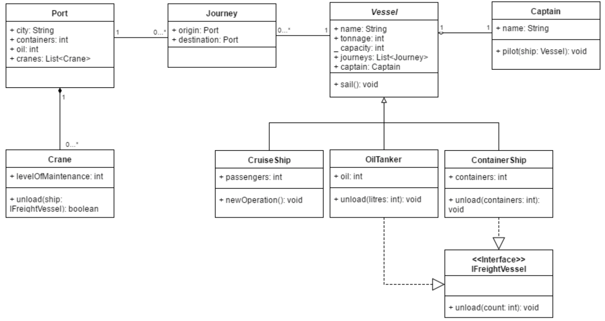
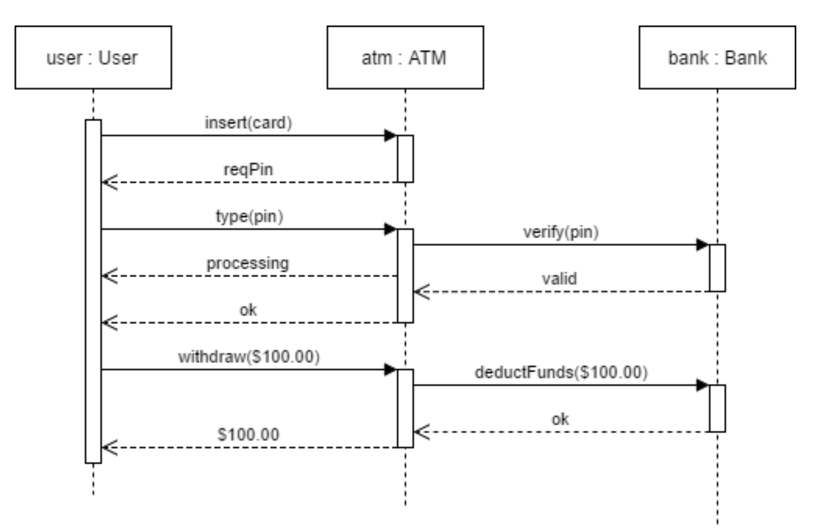

UML
======
### Git Repository
There is no source code for this lab.

## UML Diagramming Tools
For creating and modifying UML diagrams, there are different tools available online. You may use any tool you like to draw diagrams in this course. Here are some example tools that you can use:

* draw.io [(https://www.draw.io/)](https://www.draw.io/)
* UMLet [(http://www.umlet.com/)](http://www.umlet.com/)
* ArgoUML [(http://argouml.tigris.org/)](http://argouml.tigris.org/)
* UMLetino [(http://www.umletino.com/)](http://www.umletino.com/) 
* Diagramo [(http://diagramo.com/editor/editor.php)](http://diagramo.com/editor/editor.php) 

## Exercise One: Simple Sphere Class
Using either pen & paper or the diagramming tool of your choice, create a simple UML class diagram showing a `Sphere` class. A sphere has the following attributes:

    * A radius
    * A three-element array for the Cartesian coordinates of the sphere (centroid)
    * A count that stores how many instances of spheres there are
    
    
The sphere is initialised by setting the radius and the coordinates of the sphere. The count should increase if a sphere has been created. The `Sphere` class also has the following features:

    * Returns the count of all instances of spheres
    * Returns the surface area of a sphere (Surface Area=4πr2)
    * Returns the volume of a sphere (Volume=4/3 πr3)

## Exercise Two: Simple Car Class
Create a simple UML class diagram for a car. A car has the following attributes:

    * Year
    * Make (e.g. Alfa Romeo)
    * Model (e.g. Swift)
    * Body type (e.g. hatchback, sedan)
    * Transmission (e.g. manual, automatic)
    * Odometer (e.g. 9515 kms)
    * Engine (e.g. 1200cc)
    * Warrant of fitness (WoF) expiry date
    * Current price
    
    
The car class does the following:

    * Returns the values stored in the attributes (getters)
    * Sets the odometer, WoF expiry date, and car price.
    
    
## Exercise Three: Another Simple Car Class
A vehicle is an object that can be used to transport people or goods. A car from the previous exercise is a type of vehicle.  A motorcycle is also a type of vehicle. A vehicle has a name, and a production year. It can change gear, accelerate, and brake. Different types of vehicles will have different mechanisms for changing gear, accelerating, and braking. A car has the same attributes as described previously, with two additional features. The car can turn on their headlights, and turn on their windscreen wipers. A motorcycle has similar features as a car, however, it does not have a windscreen.

Modify the UML diagram to illustrate the relationships for a vehicle, a car, and a motorcycle.

`Hint: Remember to consider the similarities between cars and motorcycles, to inform you on which properties and methods should be placed in the vehicle class.`

## Exercise Four: Class Associations & Multiplicities
Create a simple class diagram, with associations and multiplicities, for the following scenario:

1. *Lecturers* teach *Courses*. Each lecturer has a name, and a list of courses they are teaching, which can be zero or more. Each course has a name, a course number, and a room. A course must be taught by exactly one lecturer.
2. *Libraries* have *Books*. Each library has a name, location, and a list of books. The library has *more than 1000* books. Each book has a name, a genre, and the library it belongs to. Each book belongs to exactly one library.

## Exercise Five: Sequence Diagrams
1. Create a *sequence* diagram relating to a banking application, in which a user is trying to make a payment to several other bank accounts.

    A *User*, *Bob*, requests to *pay $100* from *his bank account* to *Charlotte’s account*. The operation is a success, as Bob has enough funds in his account. Following this, Bob attempts to transfer $250 from his account to *Dave’s account*. This operation fails as Bob doesn’t have $250 remaining.
    
## Exercise Six: Understanding UML Diagrams
(A) Consider the following class diagram, then answer the following questions:

    1. What classes have an association relationship?
    2. What classes have an aggregation relationship?
    3. What classes have a composition relationship?
    4. Which classes implement an interface?
    5. Which classes are subclasses of another class?
    6. What attributes does the OilTanker class have?
    7. What is the multiplicity between Port and Journey?
    8. What reference types can be used to refer to a ContainerShip object?

(B) Consider the following sequence diagram for a certain application.
Write down, in plain English, what this diagram is demonstrating, in as much detail as possible.

